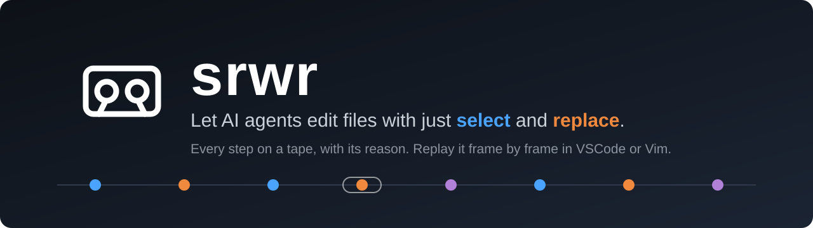
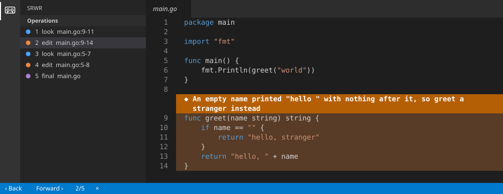

<p align="center">
  
</p>

<h3 align="center"><b>AI エージェントに <code>select</code> と <code>replace</code> の 2 つだけでファイルを編集させ、すべての操作を理由つきでテープに記録して、VSCode か Vim でコマ送りで再生する。</b></h3>

<p align="center"><i><a href="README.md">English</a> | <b>日本語</b></i></p>

<p align="center">
  <a href="https://github.com/amisonnet8/srwr/actions/workflows/ci.yml"></a>
  <a href="https://github.com/amisonnet8/srwr/releases"></a>
  <a href="LICENSE"></a>
  
  
  <a href="https://marketplace.visualstudio.com/items?itemName=amisonnet8.srwr-view"></a>
  <a href="https://marketplace.visualstudio.com/items?itemName=amisonnet8.srwr-view"></a>
</p>

<p align="center">
  
  <br>
  <sub>本物の <code>srwr view</code>（Vim）が、あるセッションをコマ送りで再生しているところ。理由の行と、その理由が指すコードが並びます。</sub>
</p>

## 目次

- [✨ 特徴](#-特徴)
- [🚀 インストール](#-インストール)
- [🧭 使い方](#-使い方)
- [👀 テープを見る](#-テープを見る)
- [🤝 テープを共有する](#-テープを共有する)
- [📚 ドキュメント](#-ドキュメント)
- [💬 対話形式のガイド](#-対話形式のガイド)
- [📄 ライセンス](#-ライセンス)

## ✨ 特徴

- ✍️ **コマンドは 2 つだけ**：AI は `select`（見る）と `replace`（変える）だけで編集します。ファイルに触れる道がほかに無いので、記録から漏れません
- 🧾 **すべての操作に理由**：呼び出しごとに `why` を添え、空のものは断ります
- 🎞️ **コマ送り**：AI がしたことを 1 コマずつ再生します。理由の行が、その理由が指すコードの真上に出ます
- 🧩 **VSCode と Vim**：[VSCode 拡張](extension/README_ja.md)と、素の Vim（`srwr view`、何も入れなくてよい）で、同じ画面です
- 📡 **ライブ**：AI が書いている最中のテープを追いかけ、好きなときに最新のコマへ戻れます
- 🔍 **外からの変更も見逃さない**：srwr の外でファイルが変わると、次の呼び出しで気づき、左右に並べた差分で見せます
- 🔒 **秘密は記録しない**：`.env`・鍵・`.srwrignore` に書いたものは、テープに載せません
- 📦 **単一バイナリ・依存なし**：Go の単一バイナリ。cgo なし。Linux・macOS・Windows
- 🕒 **わかりやすい時刻**：テープは UTC で持ち、画面ではあなたの時間帯で見せます
- 🌍 **英語と日本語**：既定は英語。`SRWR_LANG=ja` で日本語

## 🚀 インストール

先に `srwr` のバイナリが要ります。AI が話しかける相手であり、エディタがテープを読むために起動するものです。

```bash
go install github.com/amisonnet8/srwr/cmd/srwr@latest
```

Linux・macOS・Windows 向けのビルド済みバイナリは [GitHub Releases](https://github.com/amisonnet8/srwr/releases) にあります。バイナリを `PATH` の通った場所に置いてください。

VSCode で見るなら、拡張 **srwr-view** も入れます（拡張は `srwr` を含みません。[拡張の README](extension/README_ja.md)）。Vim で見るなら、Vim 9.0.0784 以上があれば、ほかには何も要りません。

## 🧭 使い方

1. **プロジェクトを準備する**（最初に 1 回）。[Claude Code](https://claude.com/claude-code) に `srwr` を登録し、既定では Edit・Write の道具を禁止して、すべての変更が `select` と `replace` を通るようにします。

   ```bash
   cd your-project
   srwr init
   ```

   <details>
   <summary><code>srwr init</code> は何を書くの？</summary>

   | ファイル | 中身 |
   |---|---|
   | `.srwr/` | テープを置くディレクトリと、鍵 |
   | `.mcp.json` | AI が使う MCP サーバー `srwr mcp` の登録 |
   | `.claude/settings.json` | AI が読んだものを記録する hook と、Edit・Write の禁止（`srwr init --lenient` なら禁止しない） |
   | `.gitignore` | 鍵とロックを無視する（テープは無視しない） |

   既存の設定は残り、2 回目は何も変えません。詳しくは [docs/reference/cli_ja.md](docs/reference/cli_ja.md)。
   </details>

2. **AI に作業させる。** `select` と `replace` はすべて、`.srwr/tapes/` のテープに載ります。

   <details>
   <summary>テープはどんな形？</summary>

   テープは JSONL のファイルで、1 行が 1 つの出来事です。次は、AI が 9〜11 行目を見た `select` と、そのあとの `replace` です。

   ```json
   {"v":1,"seq":2,"type":"select","file":"main.go","startLine":9,"endLine":11,"why":"greet is what main prints: check what it does when the name is empty","selection":"sel_041061E48KVH3K24RN324MN2","source":"mcp"}
   {"v":1,"seq":3,"type":"replace","file":"main.go","from":"sel_041061E48KVH3K24RN324MN2","startLine":9,"endLine":11,"oldText":"…","newText":"…","why":"An empty name printed \"hello \" with nothing after it, so greet a stranger instead","source":"mcp"}
   ```

   形式は [docs/reference/tape_ja.md](docs/reference/tape_ja.md) にあります。
   </details>

3. **何が起きたかを見る**（次の章）。

## 👀 テープを見る

| どこで | やり方 |
|---|---|
| **Vim** | `srwr view`（一覧から選ぶ）か `srwr view <テープ>`。`]]` で進み、`[[` で戻り、`q` で閉じます。`srwr view --live` は書かれているテープを追いかけます |
| **VSCode** | 拡張を入れ、左端の *srwr* →*操作一覧* →*テープを開く* か *ライブ視聴を開始* |
| **ターミナル** | `srwr tapes` でプロジェクトのテープを一覧します |

<p align="center">
  
  <br>
  <sub>VSCode の srwr-view。青が <code>select</code>、橙が <code>replace</code>、紫が外からの変更です。</sub>
</p>

進むのは「戻る」「進む」だけで、自動再生はありません。理由を 1 つずつ読むことが目的だからです。詳しくは [VSCode](docs/reference/vscode_ja.md) と [Vim](docs/reference/vim_ja.md)。

## 🤝 テープを共有する

テープは、触れたファイルの全文を持っていて、それだけで再生できます。`srwr tapes path <テープ>` で場所を調べて渡せば、相手は自分のエディタで開けます。

- 🔑 **`.srwr/key` は共有しない。** 再生には要りません
- 🔒 秘密を含むファイルは記録しません（`.env`・`*.pem`・`*.key`・SSH の鍵と、`.srwrignore` に書いたもの）。それでも、共有する前にテープを確かめてください
- 🕒 テープは UTC で持つので、相手には相手の時間帯で見えます

## 📚 ドキュメント

| したいこと | 読むもの |
|---|---|
| srwr を使う | [コマンドライン](docs/reference/cli_ja.md) · [設定](docs/reference/settings_ja.md) · [AI が使う道具](docs/reference/mcp_ja.md) |
| エディタで見る | [VSCode](docs/reference/vscode_ja.md) · [Vim](docs/reference/vim_ja.md) |
| テープを読む・エディタを足す | [テープの形式](docs/reference/tape_ja.md) · [表示サーバーのプロトコル](docs/reference/protocol_ja.md) |
| 作りを知る | [概要](docs/design/overview_ja.md) · [判断](docs/design/decisions_ja.md) · [制限](docs/design/limitations_ja.md) |

すべて [docs/](docs/README_ja.md) にあります（英語と日本語）。

## 💬 対話形式のガイド

質問しながら srwr を調べられます：**[Gemini Notebook で作った srwr のガイド](https://notebook.google.com/notebook/e2afe5b3-fb70-4889-adb7-7f6bbe4d2912)**。

## 📄 ライセンス

[MIT](LICENSE) © amisonnet8

<p align="right"><a href="#">⬆ 先頭へ</a></p>
