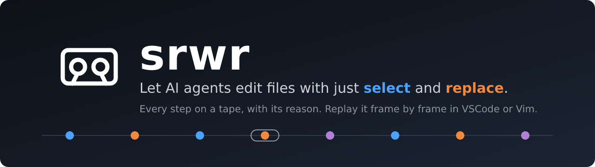
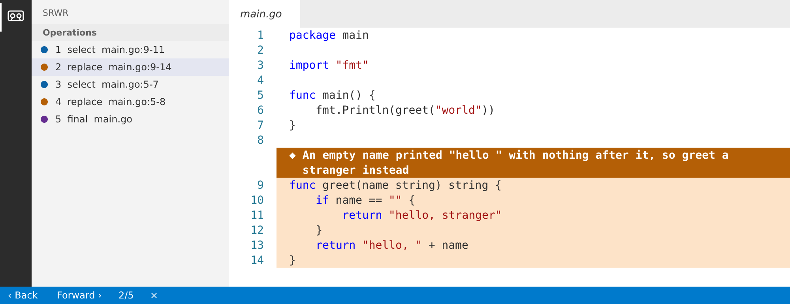

<p align="center">
  
</p>

<p align="center"><i><a href="README.md">English</a> | <b>日本語</b></i></p>

<p align="center">
  <a href="https://marketplace.visualstudio.com/items?itemName=amisonnet8.srwr-view"></a>
  <a href="https://marketplace.visualstudio.com/items?itemName=amisonnet8.srwr-view"></a>
  <a href="https://marketplace.visualstudio.com/items?itemName=amisonnet8.srwr-view"></a>
  
  <a href="https://github.com/amisonnet8/srwr/actions/workflows/ci.yml"></a>
  <a href="https://github.com/amisonnet8/srwr/blob/main/LICENSE"></a>
</p>

# srwr-view

**AI エージェントがコードに何をしたかを、1 コマずつ、各操作の理由とともに見る。** srwr-view は [srwr](https://github.com/amisonnet8/srwr) の VSCode 側です。AI は `select` と `replace` だけでファイルを編集し、すべての操作が理由つきで*テープ*に載り、この拡張がテープを再生します。



## 📋 前提条件

この拡張は描くだけです。テープを読むのは **`srwr` のバイナリ**の仕事で、拡張がそれを起動します。先に入れてください。**拡張には含まれません。**

```bash
go install github.com/amisonnet8/srwr/cmd/srwr@latest
```

- Linux・macOS・Windows 向けのビルド済みバイナリは [srwr の GitHub Releases](https://github.com/amisonnet8/srwr/releases) にもあります
- `srwr` を `PATH` に置くか、設定 [`srwr.path`](#-設定) で場所を教えます
- この版の拡張は、`protocolVersion` が **1** の表示サーバーと話します。合わないときは、どちらかを更新するよう案内が出ます
- そもそも AI にテープを記録させるには、プロジェクトで `srwr init` します。全体は [srwr の README](https://github.com/amisonnet8/srwr/blob/main/README_ja.md#-インストール) を見てください

## ✨ 機能

- 🎨 **コードの上に理由の行**：`select` は青、`replace` は橙で、その理由が指す範囲の前に出ます
- 🔍 **左右に並べた差分**：srwr の外の変更と、録画のあとの変更を、変わった行だけ塗って見せます
- ⏮️ **コマ送り**：下のバーの「戻る」「進む」。自動再生はないので、理由を 1 つずつ読めます
- 📡 **ライブ**：AI が書いている最中のテープを追いかけます。戻ると「LIVE に戻る（新着 N）」が、見逃した数を数えます
- 📜 **平らな操作一覧**：左に、1 から数えた番号と、種類を表す色の丸
- 🌍 **英語と日本語**：VSCode の表示言語に従います
- 🔒 **読むだけ**：テープもファイルも書かず、鍵も読みません

## 🚀 使い始める

1. `srwr` を入れる（上）
2. プロジェクトを VSCode で開く
3. 左端の **srwr** →**操作一覧** →**テープを開く**（または**ライブ視聴を開始**）

## ⌨️ コマンド

コマンドパレットは <kbd>Ctrl</kbd>+<kbd>Shift</kbd>+<kbd>P</kbd>（macOS は <kbd>⌘</kbd>+<kbd>Shift</kbd>+<kbd>P</kbd>）で開きます。画面の言語が日本語のときの名前は、`package.nls.ja.json` にあります。

| コマンド（英語の画面） | ID | 働き |
|---|---|---|
| srwr: Open Tape | `srwr.openTape` | この作業場のテープを選び、1 コマ目から見せる |
| srwr: Close (Tape or Live) | `srwr.closeTape` | 開いているテープかライブを閉じる |
| srwr: Forward | `srwr.stepForward` | 1 コマ進む（ライブでも効く） |
| srwr: Back | `srwr.stepBack` | 1 コマ戻る |
| srwr: Start Live View | `srwr.liveStart` | 今のセッションのテープを、書かれるそばから追う |
| srwr: Stop Live View | `srwr.liveStop` | 追うのをやめる |
| srwr: Back to LIVE | `srwr.liveLatest` | ライブで戻ったあと、最新のコマへ飛んで追い直す |

## 🔧 設定

設定は 1 つです。設定画面（「srwr」で検索）か `settings.json` で変えます。

| 設定 | 型 | 既定値 | 意味 |
|---|---|---|---|
| `srwr.path` | `string` | `"srwr"` | `srwr` のバイナリの場所。既定のままなら `PATH` から探す。見つからないときは絶対パスで指定する |

```json
{
  "srwr.path": "/home/me/go/bin/srwr"
}
```

<details>
<summary>Windows の場合</summary>

```json
{
  "srwr.path": "C:\\Users\\me\\go\\bin\\srwr.exe"
}
```
</details>

見た目の設定はありません。色と配置は固定で、誰が見ても同じ画面になります。

## 🩺 うまく動かないとき

| 出るもの | すること |
|---|---|
| 「srwr を起動できません … srwr を入れる（go install …@latest）か、設定「srwr.path」に場所を指定してください」 | `srwr` が `PATH` にありません。入れるか、`srwr.path` を設定します（「設定を開く」ボタンがそこへ飛びます） |
| 「srwr（…）と、この拡張のバージョンが合っていません（拡張は protocolVersion 1）」 | 古いほうの `srwr`（`go install …@latest`）か拡張を更新します |
| 「テープを開く」に何も出ない | 操作が 1 つ以上あるテープだけが出ます。開いたフォルダの `.srwr/tapes/` のものだけです |

## 🔗 リンク

- **[srwr](https://github.com/amisonnet8/srwr/blob/main/README_ja.md)**：本体。インストールと準備
- [ドキュメント](https://github.com/amisonnet8/srwr/blob/main/docs/README_ja.md)：[この拡張の詳細](https://github.com/amisonnet8/srwr/blob/main/docs/reference/vscode_ja.md)・[すべての設定](https://github.com/amisonnet8/srwr/blob/main/docs/reference/settings_ja.md)・[テープの形式](https://github.com/amisonnet8/srwr/blob/main/docs/reference/tape_ja.md)
- [不具合を知らせる](https://github.com/amisonnet8/srwr/issues)

[MIT](https://github.com/amisonnet8/srwr/blob/main/LICENSE) © amisonnet8
